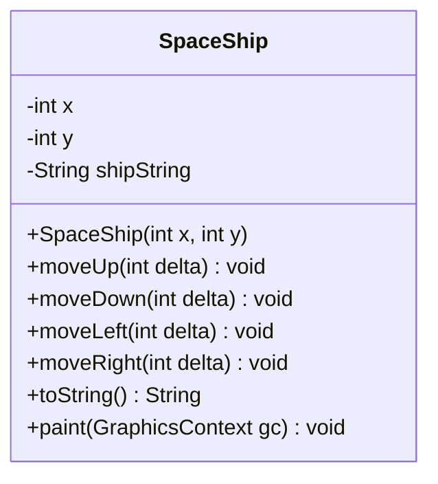

# Spaceshooter
We make a little game Spaceshooter
# Einheit 1 – SpaceShooter starten und verstehen

## Ziel der Einheit
In dieser Einheit lernst du:
- wie man das Projekt startet,
- wie der grundlegende Spielaufbau funktioniert,
- was ein **Gameloop** ist,
- welche Aufgaben die Klasse `SpaceShip` übernimmt.

!! Wir möchten das Projekt so gestalten das es IMMER auf der Kommandozeile mit maven baubar ist !!

---

## 1) Voraussetzungen
Damit das Projekt läuft, brauchst du:
- **JDK 23 oder neuer**
- **Maven**
- Internetzugang beim ersten Start (Maven lädt Abhängigkeiten)

Das Projekt ist in `pom.xml` auf Java 23 eingestellt (`maven.compiler.release=23`) und verwendet JavaFX (`javafx-controls`).

### Schnell prüfen
Im Terminal im Projektordner:

```bash
java --version
mvn -version
```

Wenn `java --version` kleiner als 23 ist, musst du ein neueres JDK aktivieren (`JAVA_HOME` / PATH anpassen).

---

## 2) Projekt starten
Im Projektordner ausführen:

```bash
mvn clean javafx:run
```

Dann sollte sich ein JavaFX-Fenster mit dem Spiel öffnen.

### Häufige Hinweise (nicht sofort Fehler)
- Warnungen zu `Unsafe` oder `--enable-native-access` sind aktuell meist nur Hinweise.
- `skip non existing resourceDirectory .../src/main/resources` ist unkritisch.

### Typischer echter Fehler
- **"unsupported release 23"**  
  → Falsches JDK aktiv (zu alt). Richtiges JDK setzen und IDE/Terminal neu starten.

---

## 3) Aufbau des Spiels
Die zentrale Startklasse ist `Starter`.

### Was in `Starter` passiert
1. JavaFX-Anwendung startet (`Application.launch(...)`).
2. Fenster (`Stage`) und Szene (`Scene`) werden erstellt.
3. Eine Zeichenfläche (`Canvas`) wird erzeugt.
4. Ein `SpaceShip`-Objekt wird angelegt (`enterprise`).
5. Tastatureingaben werden registriert (`setOnKeyPressed(this)`).
6. Der Gameloop (`AnimationTimer`) startet.

---

## 4) Wie funktioniert der Gameloop?
Der Gameloop läuft in `AnimationTimer#handle(...)` und wird pro Frame aufgerufen.

Aktueller Ablauf pro Frame:
1. Zeichenfläche löschen (`clearRect(...)`)
2. Schiff neu zeichnen (`enterprise.paint(...)`)

### Wichtig
- Bewegung wird hier über Tastatur-Events ausgelöst (Pfeiltasten),
- der Gameloop ist aktuell vor allem für das **ständige Neuzeichnen** zuständig.

Tastensteuerung:
- Pfeiltasten bewegen das Schiff
- `Shift` erhöht die Schrittweite (beschleunigt)

---

## 5) Was muss die Klasse `SpaceShip` können?
Die Klasse `SpaceShip` ist ein Spielobjekt mit **Zustand + Verhalten + Darstellung**.

### Zustand (Daten)
- Position `x`, `y`
- Textdarstellung des Schiffs (`shipString`)

### Verhalten (Logik)
- `moveUp(delta)`
- `moveDown(delta)`
- `moveLeft(delta)`
- `moveRight(delta)`

Diese Methoden ändern nur die Position.

### Darstellung (Rendering)
- `paint(GraphicsContext gc)` zeichnet das Schiff an der aktuellen Position.

### UML-Diagramm: `SpaceShip`


---

## 6) Merksatz für Spiele
Ein einfaches 2D-Spiel folgt fast immer diesem Muster:

**Input → Update → Render (zeichnen)**

Im aktuellen Stand:
- Input: Tastatur in `Starter.handle(KeyEvent)`
- Update: Positionsänderung über `SpaceShip.move...()`
- Render: Zeichnen im Gameloop über `SpaceShip.paint(...)`

---
